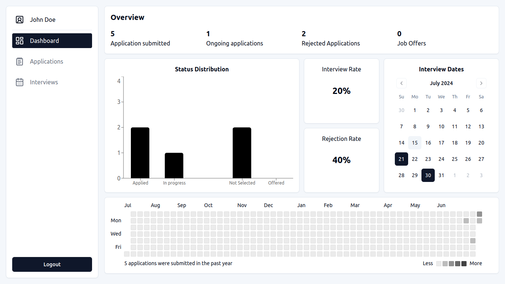

# job-tracker

A full stack application for tracking job applications and monitoring scheduled interviews.

## :camera: Screenshot



## :bulb: Features

- Account management
- Authentication using JWT Tokens
- Manage job applications
- Manage Interview schedules
- Dashboard for viewing statistics about the job applications status
- Store user data to a secured PostgreSQL database

## :hammer_and_wrench: Getting Started

> Install the backend first before the front end

### Setup backend

> The installation guide for the backend is in this [repository](https://github.com/Sanjero20/job-tracker-api).

---

### Setup frontend

Create a new folder container for both the front and the backend repositories

```
mkdir job_tracker
cd ./job_tracker
```

inside the job_tracker directory, clone this repo for the front end and rename it to client

```bash
git clone git@github.com:Sanjero20/job-tracker.git
mv job-tracker ./client
cd ./client
```

create a <code>.env</code> file containing the following:

```bash
# .env
VITE_API_URL="http://localhost:8000"
```

> if you have a deployed backend api, put that instead

Finally install the dependencies and start the front-end

```bash
pnpm i
pnpm dev
```

## :memo: License

This project is licensed under the MIT License - see the [LICENSE](./LICENSE) file for details.
